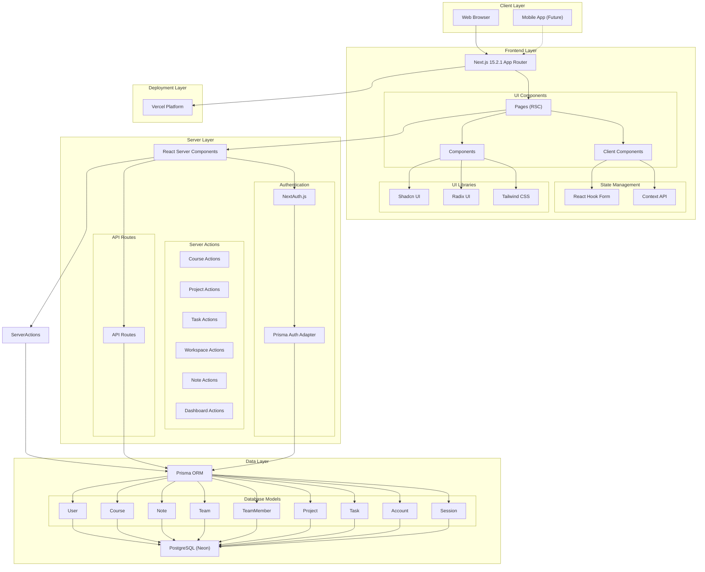
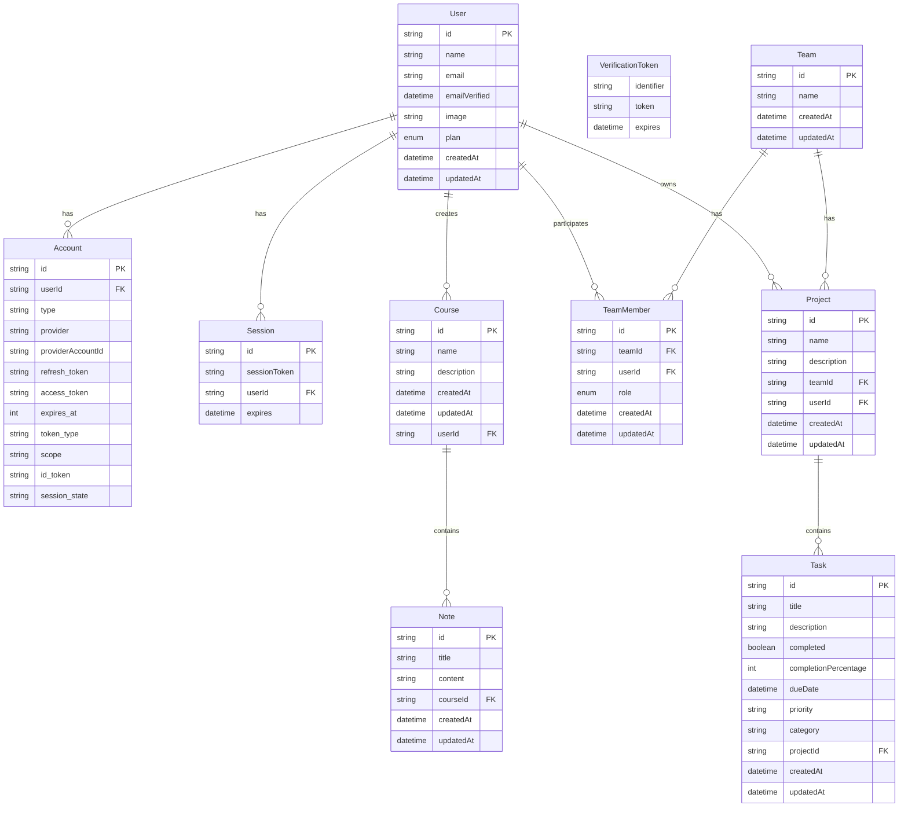
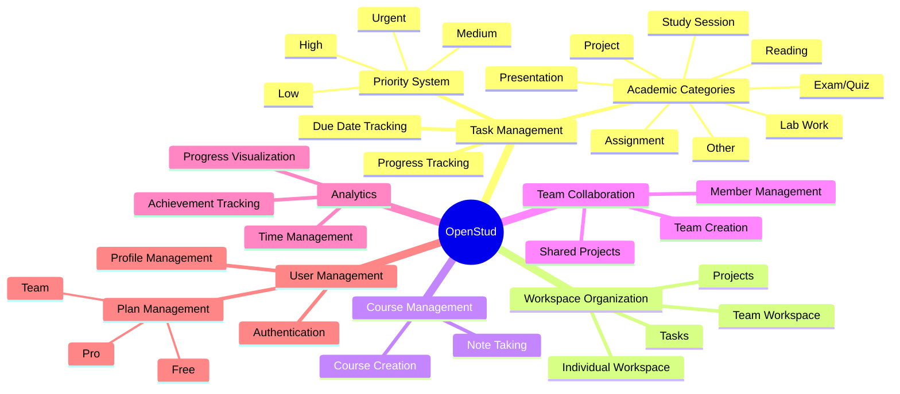
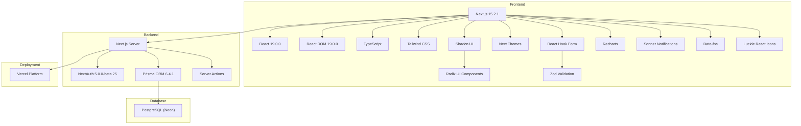
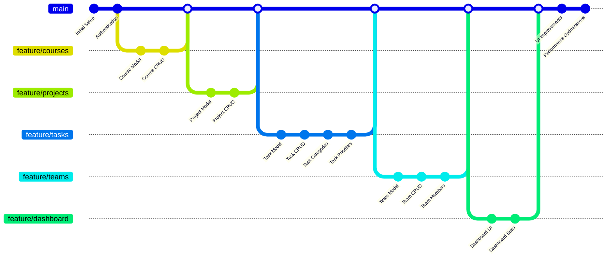

# OpenStud System Architecture

This document provides a visual guide to the system architecture and data flow of the OpenStud application.

## System Architecture

## Data Flow Diagram

```mermaid
flowchart TD
    %% User Actions
    User([User]) --> Login["Login/Register"]
    User --> ManageCourses["Manage Courses"]
    User --> ManageProjects["Manage Projects"]
    User --> ManageTasks["Manage Tasks"]
    User --> ManageTeams["Manage Teams"]
    User --> ViewDashboard["View Dashboard"]
    
    %% Authentication Flow
    Login --> NextAuth["NextAuth.js"]
    NextAuth --> AuthCheck{Authenticated?}
    AuthCheck -->|No| LoginPage["Login Page"]
    AuthCheck -->|Yes| Dashboard["Dashboard"]
    
    %% Course Management Flow
    ManageCourses --> CourseActions["Course Actions"]
    CourseActions --> CourseCreate["Create Course"]
    CourseActions --> CourseUpdate["Update Course"]
    CourseActions --> CourseDelete["Delete Course"]
    CourseActions --> CourseList["List Courses"]
    
    CourseCreate & CourseUpdate & CourseDelete & CourseList --> PrismaORM["Prisma ORM"]
    
    %% Project Management Flow
    ManageProjects --> ProjectActions["Project Actions"]
    ProjectActions --> ProjectCreate["Create Project"]
    ProjectActions --> ProjectUpdate["Update Project"]
    ProjectActions --> ProjectDelete["Delete Project"]
    ProjectActions --> ProjectList["List Projects"]
    
    ProjectCreate & ProjectUpdate & ProjectDelete & ProjectList --> PrismaORM
    
    %% Task Management Flow
    ManageTasks --> TaskActions["Task Actions"]
    TaskActions --> TaskCreate["Create Task"]
    TaskActions --> TaskUpdate["Update Task"]
    TaskActions --> TaskDelete["Delete Task"]
    TaskActions --> TaskList["List Tasks"]
    TaskActions --> TaskUpdateProgress["Update Progress"]
    TaskActions --> TaskUpdatePriority["Update Priority"]
    TaskActions --> TaskUpdateCategory["Update Category"]
    
    TaskCreate & TaskUpdate & TaskDelete & TaskList & TaskUpdateProgress & TaskUpdatePriority & TaskUpdateCategory --> PrismaORM
    
    %% Team Management Flow
    ManageTeams --> TeamActions["Team/Workspace Actions"]
    TeamActions --> TeamCreate["Create Team"]
    TeamActions --> TeamUpdate["Update Team"]
    TeamActions --> TeamDelete["Delete Team"]
    TeamActions --> TeamList["List Teams"]
    TeamActions --> TeamAddMember["Add Member"]
    TeamActions --> TeamRemoveMember["Remove Member"]
    
    TeamCreate & TeamUpdate & TeamDelete & TeamList & TeamAddMember & TeamRemoveMember --> PrismaORM
    
    %% Dashboard Flow
    ViewDashboard --> DashboardActions["Dashboard Actions"]
    DashboardActions --> GetStats["Get Statistics"]
    DashboardActions --> GetRecentActivity["Get Recent Activity"]
    DashboardActions --> GetUpcomingTasks["Get Upcoming Tasks"]
    
    GetStats & GetRecentActivity & GetUpcomingTasks --> PrismaORM
    
    %% Database Operations
    PrismaORM --> Database[(PostgreSQL)]
    
    %% Data Return Flow
    Database --> PrismaORM
    PrismaORM --> ServerComponents["React Server Components"]
    ServerComponents --> ClientComponents["Client Components"]
    ClientComponents --> UserInterface["User Interface"]
    UserInterface --> User
```

## Entity Relationship Diagram

## Features and Functionality

## Technology Stack

## Development Workflow

